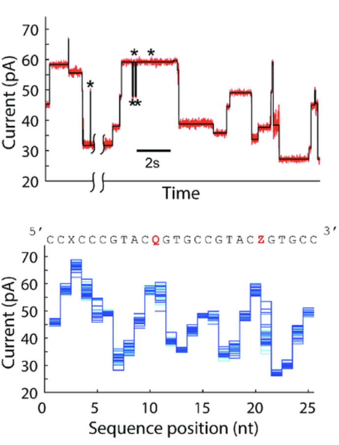

---
hide:
  - toc
---

## Convert signals into base sequences

<figure markdown> <!--
 -->
  {: style="height:250px;align=left"}
  <a href="https://journals.plos.org/plosone/article?id=10.1371/journal.pone.0143253" title="DNA">
    Craig <em> et al.  </em> 2015
  </a>

</figure>

## Methods
* Level finding and thresholding
* Hidden Markov models
* Deep Learning Methods
