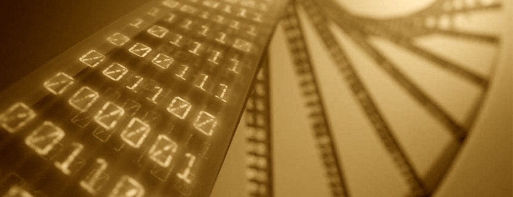

# Digitization

* Collection and routing of signals (electrons).
* Translation to digital values
* Conversion to physically-meaningful values (_photons/s_, _electrons/s_)

!!! Warning "WARNING: It is _essential_ to have confidence in what is being measured."

!!! Success "Solution: use circuit analysis/simulations to help debug and accelerate development"

<figure markdown> <!--
 -->
  {: style="height:250px;align=center"}
  <!-- <figcaption> -->
  <a href="../storage" title="storage" class="md-button">
    Next
  </a>
  <!-- </figcaption> -->
</figure>
