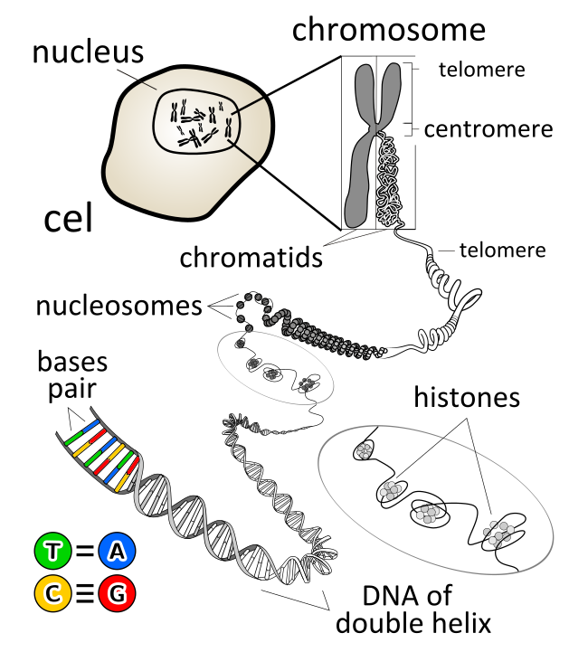

# DNA starts here
Inside our cells, DNA codes for the production of proteins and regulatory elements.

<!--
<figure markdown>

  {: style="height:450px;align=center"}
  <figcaption>
  [Source](https://en.wikipedia.org/wiki/File:DNA_orbit_animated.gif)
  </figcaption>
</figure>

  
  

-->

<!-- ]{: style="height:200px;align=center"} -->
<figure markdown> <!--
 -->
  {: style="height:350px;align=cente"}
  <!-- <figcaption> -->
  <!-- <a href="https://commons.wikimedia.org/wiki/File:Chromosome_en.svg" title="DNA">
    Source
  </a> -->
  <a href="../collection" title="Collection" class="md-button">
    Continue
  </a>

  <!-- </figcaption> -->
</figure>

<!-- The information is aggregated in functional chunks of introns, exons, genes, and a host of other regulatory elements, with a number of purposes still unknown! -->
