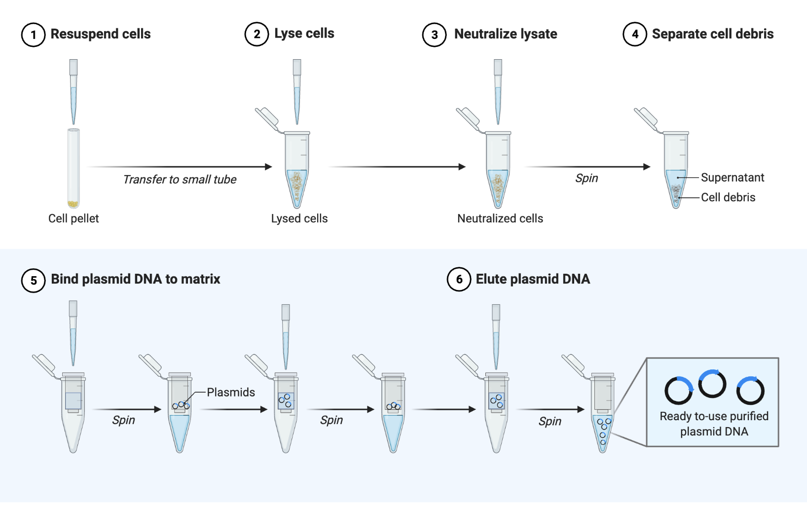

# Sample preparation
With the DNA outside of it's origin, it now has to be made ready for reading on a device.
This will involve enzymes, to repair, ligate, and otherwise adapt the DNA sample to be recorded.

!!! warning "Can be very sensitive to contamination and degradation"
!!! success "Proper documentation allows effective debugging"

<figure markdown> <!--
 -->
  {: style="height:350px;align=cente"}
  <!-- <figcaption> -->
  <!-- <a href="https://commons.wikimedia.org/wiki/File:Chromosome_en.svg" title="DNA">
    Source
  </a> -->
  <a href="../digitization" title="Collection" class="md-button">
    Continue
  </a>

  <!-- </figcaption> -->
</figure>
